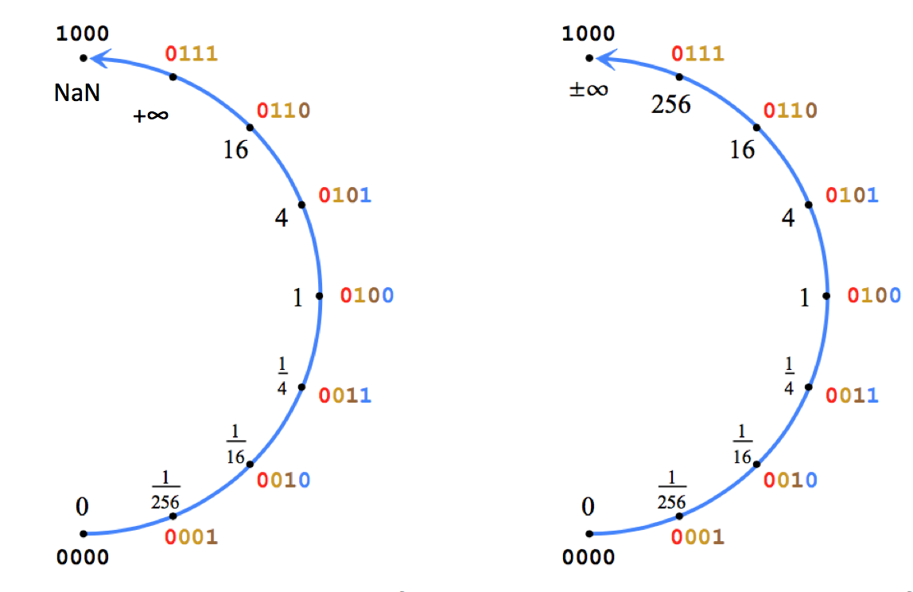

# C++ Posit implementation 

Implementation of Gustafoson Unum Type III aka Posits using C++ Templates. 

Initial inspiration was the existing C++ https://github.com/libcg/bfp but then we diverged a lot with several features as detailed below.

# Comparison with other Posit in C++

* https://github.com/libcg/bfp posit sizes specified dynamically by Clement Guerin
* https://github.com/stillwater-sc/universal template based using bitset
* https://github.com/Etaphase/FastSigmoids.jla starting from Julia and emitting C++. Based on float ops

# Features

Overall:
- Posit's total bits from 4 to 64
- storage in larger holfing typre (always signed in) e.g 12bit in 16bits
- any valid exponent bits size
- support of variant with NaN and signed Infinity (see below)
- tabulated 8bit posit operations
- implementation of operations expressed over 4 possible levels (see below)
- x86-64 Intel optimizations
- constexpr whenever possible
- integration with Eigen
- Unit Testing
- MATLAB MEX conversion and basic ops

The library supports many variants of the Posits as controlled by the template parameters: 

 template <class T,int totalbits, int esbits, class FT, bool withnan>

- this is a Posit with totalbits size and it is stored in an storage type of class T whose sie is smaller than totalbits. 
- totalbits can go from 2 to 63
- esbits is the maximum exponent size in bits. Values from 0 to totalbits-1 are support
- FT is the data type that holds the fractional part during operations
- withnan is a boolean flags that activates the Posit With NaN extension (see below)

# Development Machines

* macOS with i7 4th gen
* Linux with i7 6th gen
* NVidia Tegra TX2 with ARMv8

# Posit with NaN

In some scenarios it is needed to have a treatment of NaN and signed infinity compatible with IEEE floats. For this reason I have introduced a Posit modality with these features. The implementation is straightforward and compatible with the properties of Posit:

* NaN is opposite position to 0 that is  1(0)+ (e.g. 100000000 in 8bit), usually represented by Infinity
* Positive and Negative infinities are on the right and left of the NaN, each negation of the other: 0(1)+ and 1(0)+1
* it respect ordering of values
* unfortunately we need to give away for the maximum value

# Tools

Listposits allows to print the stats about any supported Posit type or list all the values and some operations. Due to the fact that we specify it using compile time types it is better to use the cling interpreter. Listposits allows for printing many different stats based on a printf like interface.

        H: head only
        N: no header
        I: inverse
        2: twice
        A: half
        U: unsigned order instead of signed order
        B: binary output emitting all doubles without header

        i: signed integer
        b: binary form
        v: float valu
        u: unpacked form
        p: posit object print

        k: k factor
        e: exponent

The script in scripts/listpositany eases the use. The following is similar to the lookup result for posit 4 and exp 1.

	listpositany.sh int16_t,4,1,uint16_t,false -DLISTFORMAT=Uibkerv

# Operation Implementation Level

We define 4 level of operations for working with Posits, then in the next section we show the level of implementation of every level:

* Level 1: binary manipulation of the posit in the storage type
* Level 2: decoding of the fields (S R E F) in storage type without building the exponent
* Level 3: using a fully unpacked version (S EXP F) with the full exponent and extended fraction
* Level 4: native IEEE float

| op  | level  | notes  | 
|---|---|---|
| classify(x)  | 1  |   |
| -x  |  1 |   |
| x <=> y  | 1 | |
| inv(x)  | 2 (if F=0) 3 otherwise |   |
| x/2 | 2 | |
| 2x | 2  | |
| x+y | 3 | |
| x*y | 3 | |
| x/y | 3 | | 
| exp2(x) | 4  | |
| -> float | 3 | |
| <- float | 3 | |

## Valids 

| op  | level  | notes  | 
|---|---|---|
| classify(x)  | 1  |   |
| -x  |  1 |   |
| x <=> y  | 1 | |
| inv(x)  | 1 (exact) |   |
| x/2 | 2 | |
| 2x | 2  | |
| x+y | 4 | |
| x*y | 4 | |
| x/y | 4 | | 
| exp2(x) | 4  | |
| -> float | 4 | |
| <- float | 4 | |

# Value Classes and Posit Encoding

A Posit is encoded as a signed integer with complement 2 sign representation. The first MSB is the sign and operations on negative posit are executed typically after absolute value. The second MSB is the inversion bit that is used to mark values above one and the ones below.

Important numbers:
* Infinity 1(0)+ for Posit without NaN, otherwise NaN 1(0)+ 
* +Infinity 0(1)+ for Posits with NaN
* one is 001(0)+
* two is 010(E=1)0+ where E is over e bits, that is 010(0){-1}0?
* 1/2 is 001(Emax)0+ where E is ove e bits, that is 001(1){e}0?
* fractionary numbers have inversion bit 0

Above we used the EBNF like notation for expressing the bit patterns.

# Approach 

Everything is template based (while bfp was not) and we define three key types: UnpackedLow, Unpacked and Posit.

Unpacked is parametrized to the type of the fraction (mantissa) and it can handle the conversion to/from any type of IEEE floating point number (expressed via trait) and posit.

The UnpackedLow is:
- type: Infinity, Zero, Nan, Regular
- regime
- exponent
- fraction MSB aligned

The Unpacked is:
- type: Infinity, Zero, Nan, Regular
- any integer type will be good as fraction type (in theory this could be adapted to Boost multiprecision big integerr)
- integer exponent

Posit is parametrized as follows:
- storage type (signed integer, e.g. 16,32,64 bit)
- number of bits of the posit (<= of the storage type)
- number of bits of the exponent (fixed as in bfp)
- type for expression the fraction

Each Posit type is linked to a corresponding Unpacked type via the fraction type

For Posit with 8-bits we provide a distinct Posit8 type that uses tables for resolution

# Usage

Interface with Eigen is possible with possible optimizations

Eventually it is possible to use cling

 cling -D "POSIT_TYPE=Posit<int8_t,8,2,uint8_t>" ".x listposits.cpp"

# Constexpr

C++14 allows many operations but it is not possible to efficiently convert constant float to our unpacked (no union availale or reinterpret cast). As shown in fptemplate it is possible to convert to float.

# Testing Posit12

scripts/listpositany.sh ignore -DPOSIT_TYPEID=posit12 > a
scripts/listpositany.sh int16_t,12,2,uint16_t,false > b

# Related

MPFR
Boost Multiprecision: big integer could replace the fractional part, big float could replace unpacked at all
fptemplate (from here https://www.edwardrosten.com/code/fp_template.html and githubbed here https://github.com/eruffaldi/fptemplate)

constexpr C++14 (not used yet)
https://github.com/elbeno/constexpr

FP16<->Integer 
https://github.com/Maratyszcza/FP16